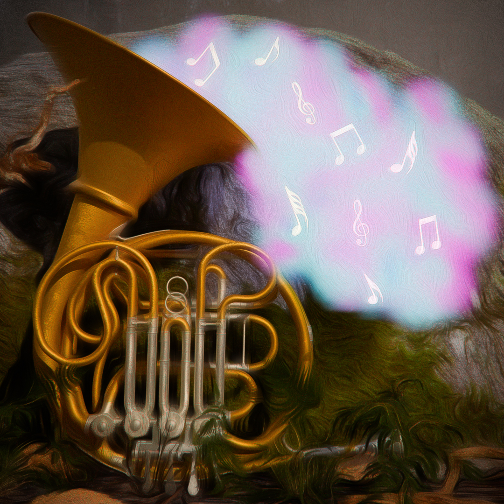

# OrchestraDiscordBot V0.9.1.1



A DPP bot written in C++20. That supports all that supports `yt-dlp` and also raw audio urls. Currently bot is only capable of functioning normally at one guild per time. So that means that it is impossible to play tracks on different guild simultaneosly(this feature will be done in some time).

### Requirements: 
- **[DPP](https://github.com/brainboxdotcc/DPP)** - I include this lib via vcpkg, therefore I am not sure whether it will work with other stuff.
- **FFmpeg** - I include this lib via vcpkg, therefore I am not sure whether it will work with other stuff.
- **yt-dlp** - you should download .exe from official page and put the path to .exe in Resources/config.txt to a varialbe `yt_dlp`. Example: `String yt_dlp = "C:/yt-dlp/yt-dlp.exe";`

### Building

In order to include **DPP** and **FFmpeg** with vcpkg and exclude any errors during build process, it is necessary to: install **FFmpeg** via vcpkg(I used this [tutorial](https://gist.github.com/genbtc/ffbcd1c6e2a02b03e9a86e82d3d54f21)) and **DPP**, then to build **OrchestraDiscordBot** call CMake with `-DVCPKG_ROOT` parameter and assign a path to it. Note: path, which you set when using `-DVCPKG_ROOT` is the path to folder in which `vcpkg.exe` is located. Example: `cmake -DVCPKG_ROOT="C:/vcpkg" ..`(here I am calling this while being located in `.../OrchestraDiscordBot/Build`). Also it is required to this only the first time, when you build **OrchestraDiscordBot**.

Also there is a small issue assosiated with Debug and Release build modes. I didn't find a way to make it automatically with CMake(I mean copying .dlls mainly), so to build Debug or Release you should comment and uncomment certain `CMakeLists.txt` lines. Look for such lines: `#adjust if you want Debug or Release .dlls, because I didn't find a way to do it in CMake ._.`

### About Resources/config.txt

All variables must be filled at least with any value, otherwise an exception will be thrown.

Variables which you should necessarily set values: **`botToken`** and **`yt_dlp`**.

List of variables:
- **`botToken`** - a discord bot token, which you should get from *Discord developer portal*.
- **`commandPrefix`** - a string prefix which is used to determine command calls.
- **`paramPrefix`** - a single character prefix which is used to determine command's parameters.
- **`yt_dlp`** - a string, which must contain a path to `yt-dlp.exe`.
- **`sentPacketsSize`** - a number of bytes which will be sent per packet. 15000 is ~7 seconds, it is considered to be an optimal value, because with lower ones it was noticed slight sound tearing.
- **`enableLoggingSentPackets`** - whether to print info about sent packet.
- **`adminSnowflake`** - this is a ID of a user from which you can access files, when using `play` command with `-raw` parameter.

### About yt-dlp.conf

`yt-dlp.conf` is a recommended config file that should be put with `yt-dlp.exe` in the same folder.

Recommended settings:
```
--no-post-overwrites
--quiet
--no-check-certificate
--geo-bypass
--skip-download
--ignore-errors
```
Also you can insert `--cookies`, if you want to broaden a number of tracks that will be processed, however I found that with this parameter set it gets raw audio url even longer.

### How does **OrchestraDiscordBot** even work?
Well it does a lot stuff(use `help` command to see all supported commands), but it basically delivers all hard work of getting a raw track url to `yt-dlp`, which takes a drastic amount of time(on my machine is ~6 seconds), however I didn't manage to boost it somehow or find any alternatives.

# List of commands


### `!help`  
Prints out all available commands and also the command's description if it exists.


### `!play`  
Joins your voice channel and plays audio from YouTube or SoundCloud, or from raw URL to audio, or admin's local files  
(note: a whole bunch of formats are not supported). Playlists are supported!

**Params:**
- `[float] -speed`  
	Changes speed of audio. If speed < 1: audio plays faster. This param can be called while audio is playing.

- `[int] -repeat`  
	Repeats audio for certain number. If repeat < 0: the audio will be playing for 2147483647 times.

- `[bool] -search`  
	If search is explicitly set: it will search or not search via yt-dlp.

- `[string] -searchengine`  
	A certain search engine that will be used to find URL.  
	Supported: `yt` - Youtube (default), `sc` - SoundCloud.

- `[bool] -noinfo`  
	If noinfo is true: the info (name, URL (optional), duration) about track won't be sent.

- `[bool] -raw`  
	If raw is false: it won't use yt-dlp for finding a raw URL to audio.

- `[int] -index`  
	The index of a playlist item. Used only if input music value is a playlist.

- `[bool] -shuffle`  
	Whether to shuffle tracks of a playlist.

### `!skip`  
Skips current track.

**Params:**
- `[float] -secs`  
	Skips given amount of seconds.

- `[float] -tosecs`  
	If tosecs < 0: it will skip to the beginning of the audio. Skips up to the given time.

- `[int] -in`  
	Skips in the given index in the current playing playlist.

- `[int] -to`  
	Skips to the given index in the current playing playlist.  
	If toindex is bigger than a playlist size, then it will skip entire playlist.

- `[bool] -playlist`  
	Skips entire playlist.

- `[bool] -middle`  
	Skips to the middle of the queue.

- `[bool] -last`  
	Skips to the last track.


### `!shuffle`  
Shuffles all tracks that are in the queue.  
Forgets about playlists repeats, but not the speeds.


### `!delete`  
Deletes tracks in the queue by index.  
It is not recommended to use this command to delete a range of tracks, but you can try.

**Params:**
- `[bool] -current`  
	Deletes current track from the queue.

- `[bool] -middle`  
	Deletes middle track from the queue.

- `[bool] -last`  
	Deletes last track from the queue.

- `[int] -from`  
	Deletes track from given index to the end of the queue or if used with "to" param, it will delete the given range of tracks.

- `[int] -to`  
	Deletes track from the queue from the beginning to the given index or if used with "from" param, it will delete the given range of tracks.

- `[int] -playlist`  
	Deletes playlist by index. If input "playlist" == -1, it will remove current playlist.


### `!current`  
Prints info about current track, if it plays.

**Params:**
- `[bool] -url`  
	Whether to show urls of tracks.


### `!queue`  
Prints current queue of tracks.

**Params:**
- `[bool] -url`  
	Whether to show urls of tracks.


### `!pause`  
Pauses the audio.


### `!stop`  
Stops all audio.


### `!leave`  
Disconnects from a voice channel.


### `!terminate`  
Terminates the bot. Only admin can use this command.


